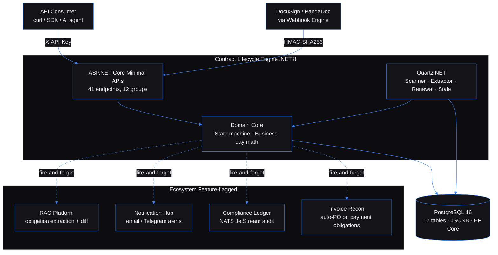

# Contract Lifecycle Engine — tracks every obligation buried in every contract you've ever signed, and tells you before anything lapses

Built by [Kingsley Onoh](https://kingsleyonoh.com) · Systems Architect

## The Problem

Mid-market companies carry 200–500 active vendor and customer contracts. Every one of them hides payment deadlines, renewal notice windows, reporting duties, and SLA commitments in dense legal prose. Most legal-ops teams track these in spreadsheets, which is why companies routinely eat 5–15% cost overruns from silently auto-renewed contracts and bleed $40–80K/year in administrative labor chasing dates that a machine should have flagged weeks earlier. This system ingests the contracts, uses AI to pull every obligation out with its deadline and clause reference, and runs an hourly scanner that escalates anything getting close to a breach.

## Architecture



## Key Decisions

- I chose **event-sourced obligation history** over mutable status fields. Every status change on an obligation inserts a row into `obligation_events` — insert-only, no UPDATE, no DELETE. A missed obligation becomes a legal liability; reconstructing who changed what, when, and why has to be trivial. Mutable state doesn't give you that.
- I chose **extract-then-confirm** over auto-activation for AI-pulled obligations. Everything the RAG Platform extracts lands in `pending` status and stays there until a human confirms it. An auto-activated false positive creates a phantom commitment — dismissing a true positive is just noise. False positives are the more expensive failure mode.
- I chose **feature-flagged ecosystem integrations** over required wiring. Every `{SERVICE}_ENABLED` flag defaults to `false`. The core contract + obligation engine works standalone with zero external HTTP calls. RAG extraction, notifications, compliance events, and auto-PO creation are enhancements, never gates — the system boots and serves traffic even when every integration is off.
- I chose **business-day precision** over calendar-day approximation. Deadlines are computed against holiday calendars (US, DE, UK, NL, plus tenant custom holidays) and the obligation's own `business_day_calendar` + `grace_period_days`. "Approximately on time" is not acceptable for legal obligations.
- I chose **C# / .NET 8** over the portfolio's usual Python / Go / TypeScript. First .NET project in the ecosystem. EF Core's global query filters give me tenant scoping for free across 12 entities, Quartz.NET handles four cron-scheduled jobs with clean concurrency semantics, and the type system pays for itself every time the state machine rejects an invalid transition at compile time instead of at runtime.

## Setup

### Prerequisites

- .NET 8 SDK (`8.0.400` or newer)
- Docker + Docker Compose (for local PostgreSQL)
- PowerShell or bash

### Installation

```bash
git clone https://github.com/kingsleyonoh/contract-lifecycle-engine.git
cd contract-lifecycle-engine
dotnet restore
```

### Environment

```bash
cp .env.example .env
```

Required variables (full catalogue in `.env.example`):

| Variable | Purpose | Default |
|----------|---------|---------|
| `DATABASE_URL` | PostgreSQL connection (Npgsql format) | `Host=localhost;Port=5445;Database=contract_engine;Username=contract_engine;Password=localdev` |
| `PORT` | API listen port | `5000` |
| `AUTO_MIGRATE` | Apply EF Core migrations on startup | `true` |
| `AUTO_SEED` | Seed holiday calendars + first tenant on first boot | `true` |
| `SELF_REGISTRATION_ENABLED` | Public `POST /api/tenants/register` endpoint | `true` |
| `DOCUMENT_STORAGE_PATH` | Local filesystem root for uploaded contracts | `data/documents` |
| `ALERT_WINDOWS_DAYS` | CSV of days-before-deadline to alert at | `90,30,14,7,1` |
| `RAG_PLATFORM_{URL,API_KEY,ENABLED}` | Obligation extraction via the RAG Platform | `_ENABLED=false` |
| `NOTIFICATION_HUB_{URL,API_KEY,ENABLED}` | Email / Telegram deadline alerts | `_ENABLED=false` |
| `WEBHOOK_SIGNING_SECRET`, `WEBHOOK_ENGINE_ENABLED` | Inbound signed-contract webhooks | `_ENABLED=false` |
| `WORKFLOW_ENGINE_{URL,API_KEY,ENABLED}` | Amendment approval workflows | `_ENABLED=false` |
| `NATS_URL`, `COMPLIANCE_LEDGER_ENABLED` | NATS JetStream audit events | `_ENABLED=false` |
| `INVOICE_RECON_{URL,API_KEY,ENABLED}` | Auto-create POs from payment obligations | `_ENABLED=false` |
| `SENTRY_DSN` | Error tracking (empty = disabled) | empty |
| `LOG_LEVEL` | Serilog minimum level | `Information` |

### Run

```bash
docker compose up -d db
dotnet ef database update --project src/ContractEngine.Infrastructure --startup-project src/ContractEngine.Api
dotnet run --project src/ContractEngine.Api
```

On first boot the seeder prints a tenant API key (`cle_live_{32_hex}`) to stdout once. Copy it — it is not recoverable.

## How It Works

The system has one canonical journey — a signed contract lands, obligations come out, deadlines get tracked. Everything else is variations on this flow.

```
┌─────────────────────────────────────────────────────────────────────┐
│  Signed contract arrives (upload OR webhook from DocuSign/PandaDoc) │
└───────────────────────────────┬─────────────────────────────────────┘
                                │
                                ▼
            ┌──────────────────────────────────────┐
            │ Draft Contract created, document     │
            │ stored at {tenant}/{contract}/{file} │
            └───────────────────┬──────────────────┘
                                │
                                ▼
            ┌──────────────────────────────────────┐
            │ Extraction job queued                │
            │ ExtractionProcessorJob (every 5 min) │
            │ uploads doc to RAG Platform,         │
            │ runs 4 prompt types, parses results  │
            └───────────────────┬──────────────────┘
                                │
                                ▼
            ┌──────────────────────────────────────┐
            │ Obligations land in `pending` state  │
            │ Human reviews → confirm or dismiss   │
            └───────────────────┬──────────────────┘
                                │
                                ▼
            ┌──────────────────────────────────────┐
            │ DeadlineScannerJob (hourly)          │
            │ active → upcoming → due →            │
            │ overdue → escalated                  │
            │ Each transition: immutable event +   │
            │ optional alert + optional Hub event  │
            └──────────────────────────────────────┘
```

Every transition writes an `obligation_events` row. The scanner is idempotent — re-running the same window is a no-op because the target status is already set.

## Usage

Every call below uses `localhost:5000` because this build is not deployed to a public URL yet. Swap the host when it is. Every request except the four public ones requires `X-API-Key: cle_live_...`.

### 1. Get a tenant API key

```bash
curl -X POST http://localhost:5000/api/tenants/register \
  -H "Content-Type: application/json" \
  -d '{"name":"Acme Corp","default_timezone":"US/Eastern"}'
# → { "id": "...", "name": "Acme Corp", "apiKey": "cle_live_8f3a..." }
```

### 2. Create a contract and upload the signed document

```bash
# Create the contract (counterparty is auto-created if new)
curl -X POST http://localhost:5000/api/contracts \
  -H "X-API-Key: cle_live_..." \
  -H "Content-Type: application/json" \
  -d '{
    "title": "MSA with Globex",
    "counterparty_id": "<uuid>",
    "contract_type": "vendor",
    "effective_date": "2026-01-01",
    "end_date": "2027-01-01",
    "auto_renewal": true,
    "auto_renewal_period_months": 12,
    "total_value": 120000,
    "currency": "USD"
  }'

# Upload the PDF
curl -X POST http://localhost:5000/api/contracts/<contract-id>/documents \
  -H "X-API-Key: cle_live_..." \
  -F "file=@msa-globex.pdf"

# Activate it (draft → active)
curl -X POST http://localhost:5000/api/contracts/<contract-id>/activate \
  -H "X-API-Key: cle_live_..."
```

### 3. Extract obligations with AI

```bash
curl -X POST http://localhost:5000/api/contracts/<contract-id>/extract \
  -H "X-API-Key: cle_live_..." \
  -H "Content-Type: application/json" \
  -d '{"prompt_types":["payment","renewal","compliance","performance"]}'
# → { "id": "<job-id>", "status": "queued", "prompt_types": [...] }
```

The `ExtractionProcessorJob` picks up the queued job within 5 minutes. List the results:

```bash
curl "http://localhost:5000/api/obligations?contract_id=<contract-id>&status=pending" \
  -H "X-API-Key: cle_live_..."
```

Each pending obligation carries `confidence_score`, `clause_reference`, `deadline_formula`, and the full extracted text. Confirm the ones that are real:

```bash
curl -X POST http://localhost:5000/api/obligations/<obligation-id>/confirm \
  -H "X-API-Key: cle_live_..."
# → { "id": "...", "status": "active", ... }
```

### 4. Watch deadlines and acknowledge alerts

The `DeadlineScannerJob` runs every hour. When an obligation enters any of the alert windows (90, 30, 14, 7, 1 business days before `next_due_date`), a `deadline_alerts` row is written and — if `NOTIFICATION_HUB_ENABLED=true` — an `obligation.deadline.approaching` event is published to the Notification Hub.

```bash
curl "http://localhost:5000/api/alerts?acknowledged=false" \
  -H "X-API-Key: cle_live_..."

curl -X PATCH http://localhost:5000/api/alerts/<alert-id>/acknowledge \
  -H "X-API-Key: cle_live_..."
```

### 5. Dashboard

```bash
curl http://localhost:5000/api/analytics/dashboard \
  -H "X-API-Key: cle_live_..."
# → { "active_contracts": 42, "pending_obligations": 7, "overdue_count": 0,
#     "upcoming_deadlines_7d": 3, "upcoming_deadlines_30d": 11,
#     "expiring_contracts_90d": 4, "unacknowledged_alerts": 6 }
```

### Inbound signed-contract webhooks

When `WEBHOOK_ENGINE_ENABLED=true`, the engine accepts DocuSign `envelope.completed` and PandaDoc `document_state_changed` payloads at `POST /api/webhooks/contract-signed?source={docusign|pandadoc}` with HMAC-SHA256 signature verification. The handler creates a Draft contract, downloads the signed PDF, uploads it to storage, and queues an extraction job — all idempotent on `envelope_id` / `document_id`. Full setup in [`docs/operations/webhook-engine-setup.md`](docs/operations/webhook-engine-setup.md).

## Tests

```bash
dotnet test                                          # 714 non-E2E tests (Core 313 + Api 182 + Integration 219)
dotnet test tests/ContractEngine.E2E.Tests/          # Real Kestrel subprocess tests (ports 5050–5062)
```

E2E tests spawn a real compiled binary over HTTP on dedicated ports — they catch middleware ordering, port binding, and startup bugs that in-process `WebApplicationFactory` tests miss.

## AI Integration

This project ships with machine-readable context for AI tools:

| File | What it does |
|------|-------------|
| [`llms.txt`](llms.txt) | Project summary for LLMs ([llmstxt.org](https://llmstxt.org)) |
| [`AGENTS.md`](AGENTS.md) | Full codebase instructions for AI coding agents |
| [`openapi.yaml`](openapi.yaml) | OpenAPI 3.1 API specification |
| [`mcp.json`](mcp.json) | MCP server definition for AI IDEs |

### Cursor / other AI IDEs

Point your AI agent at `AGENTS.md` for full codebase context — dependency hierarchy, tenant model, key patterns, and the complete list of gotchas discovered during the build.

## Deployment

The project is containerised and production-capable via `docker build` + manual `docker compose -f docker-compose.prod.yml up -d`. The prod compose file is wired for Caddy reverse-proxy labels on `contracts.kingsleyonoh.com`, but no VPS is currently provisioned — CI/CD + VPS deployment is out of scope for this build. The image exists on GHCR.

### Production Stack

| Component | Role |
|-----------|------|
| `app` | Contract Lifecycle Engine — ASP.NET Core 8 on port 5000, mounts a `documents` named volume at `/app/data/documents` |
| `db` | PostgreSQL 16 alpine — persisted to `pgdata` volume, health-checked via `pg_isready` |
| `nats` | NATS 2 with JetStream (optional, `nats` profile) — only needed when `COMPLIANCE_LEDGER_ENABLED=true` |

### Self-Host

```bash
# Pull the image
docker pull ghcr.io/kingsleyonoh/contract-lifecycle-engine:latest

# Or use the compose file
docker compose -f docker-compose.prod.yml up -d
```

Set the environment variables listed in **Setup > Environment** before starting — `DATABASE_URL`, `POSTGRES_USER`, `POSTGRES_PASSWORD`, plus any `{SERVICE}_ENABLED=true` ecosystem flags you plan to switch on.

---

Full case study, architectural breakdown, and engineering deep-dive at [kingsleyonoh.com/projects/contract-lifecycle-engine](https://www.kingsleyonoh.com/projects/contract-lifecycle-engine)
